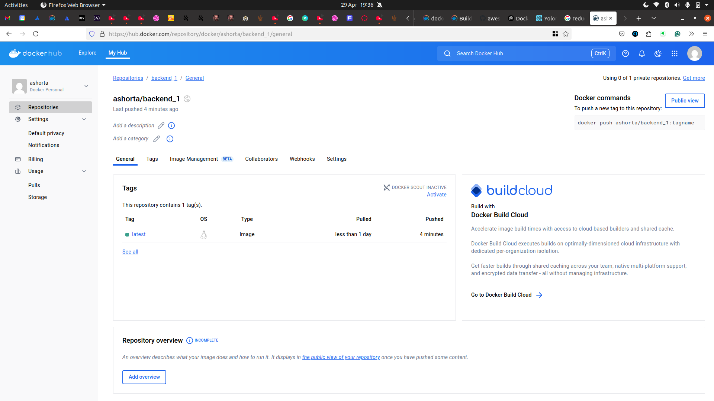

# Project walkthrough
1. Chose the node 14-alpine image for both the frontend and backend so as to limit the size of the image
2. Create the docker images for the different parts of the application
```
    # frontend while inside the client folder or backend
    $ docker build -t <docker_hub_username>/<name_of_container> .
```
3. Deploy both the frontend and backend images to docker hub
```
    > docker push <docker_username>/<image_name>
```
 <br />


4. create docker-compose for the orchestration
```
    #step one
    > create frontend service
        - use deployed frontend image from docker hub
        - use explicit container name with container_name option
        - add build context to be the client folder
        - add backend service:__yet to be created__ as a dependancy
        - expose same ports exposed in the container
        - add stdin_open to allow for comtainer to be open and running


    #step two
    > create backend service
        - use deployed backend image from docker hub
        - use explicit container name with container_name option
        - add build context to be the backend folder
        - add mongo service:__yet to be created__ as a dependancy
        - expose same ports exposed in the container
        - add stdin_open to allow for comtainer to be open and running
```